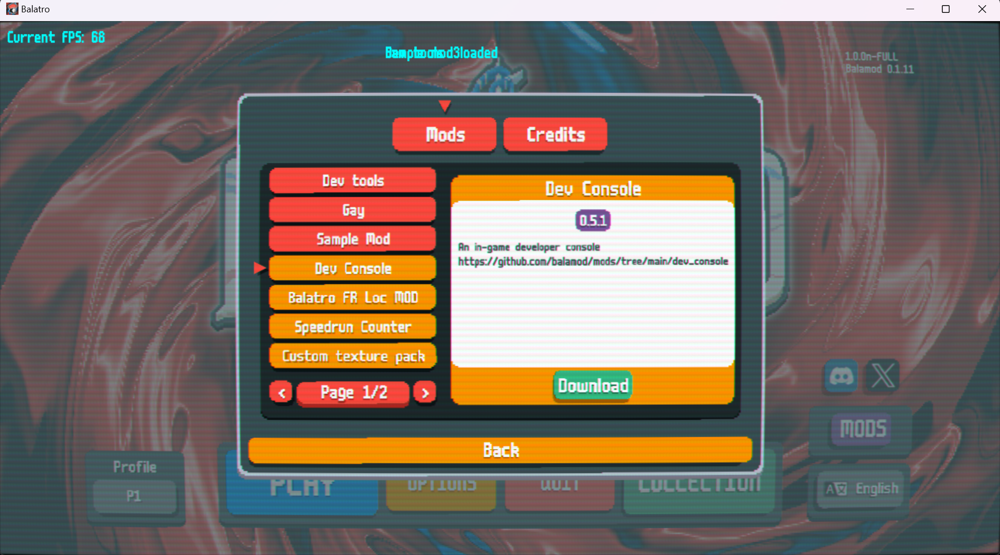

# Installation

If you are new to Balamod, this guide will help you install Balamod mod-loader on your game copy. 

After the injection, You are able to browse the mods contributed by the community in the in-game Mod Menu.



## Download Balamod Binary

Currently, the latest version is `{{ balamod.latest_tag }}` published on `{{ balamod.published_at | date(format="%Y-%m-%d %H:%M") }}`.

```admonish warning

Balamod currently doesn't work on macOS i386/amd64, but it will work on Apple Silicon(ARM64) aka M1/M2/M3.

```

Download the binary that corresponds to your platform.

| Platform | Download link |
|----------|---------------|
| <i class="fa fa-windows"></i> Windows  | [{{ balamod.release_name_windows }}]({{ balamod.release_url_windows }}) |
| <i class="fa fa-apple"></i> macOS    | [{{ balamod.release_name_macos }}]({{ balamod.release_url_macos }}) |
| <i class="fa fa-linux"></i> Linux    | [{{ balamod.release_name_linux }}]({{ balamod.release_url_linux }}) |

You also can download the latest Balamod binary from the [GitHub releases page](https://github.com/UwUDev/balamod/releases/latest).

## Install Balamod

### Windows

Execute the downloaded binary in a terminal with the following command:

```bash
.\{{ balamod.release_name_windows }} -a
```

~~~admonish info
For people who are not familiar with the command line, you can simply install Balamod as follows:

1. Open the folder where the balamod binary is located.
2. Click the address bar and type `cmd` and press Enter. A Command Prompt window will open.
3. Type `.\{{ balamod.release_name_windows }} -a`.
4. Press Enter.

The output of Command Prompt will look like this:

```cmd
C:\Users\user\Downloads\Programs>.\{{ balamod.release_name_windows }} -a
Found 1 Balatro installations.
Balatro v1.0.0n found !
Implementing mod-loader on main...
Implementing mod-loader on uidef...
Done!
Injecting main
Done!
Injecting uidef
Done!
Total time: 266.0006ms
Backup of executable: 18.2463ms
mod-loader implementation (main): 234µs
mod-loader implementation (uidef): 372µs
mod-loader injection (main): 157.8571ms
mod-loader injection (uidef): 86.2937ms

C:\Users\user\Downloads\Programs>
```
~~~

### macOS

Double-click the downloaded file (`{{ balamod.release_name_macos }}`) and follow the installation instructions. After that, open the terminal and execute the following command:

```bash
./balamod -a
```

### Linux

Execute the downloaded binary in a terminal with the following command:

```bash
chmod +x {{ balamod.release_name_linux }}
./{{ balamod.release_name_linux }} -a
```

## Verify Installation

To verify that Balamod is installed correctly. Just run Balatro Game and you will see the Balamod Version in the top right corner of the game.


## Update Balamod

To update Balamod, you need to restore the `balatro` to its original state and then install the new version of Balamod.

Please refer to the [Uninstall](getting-started.md#uninstall) guide to restore the game to its original state.

After that, you can install the new version of Balamod.


