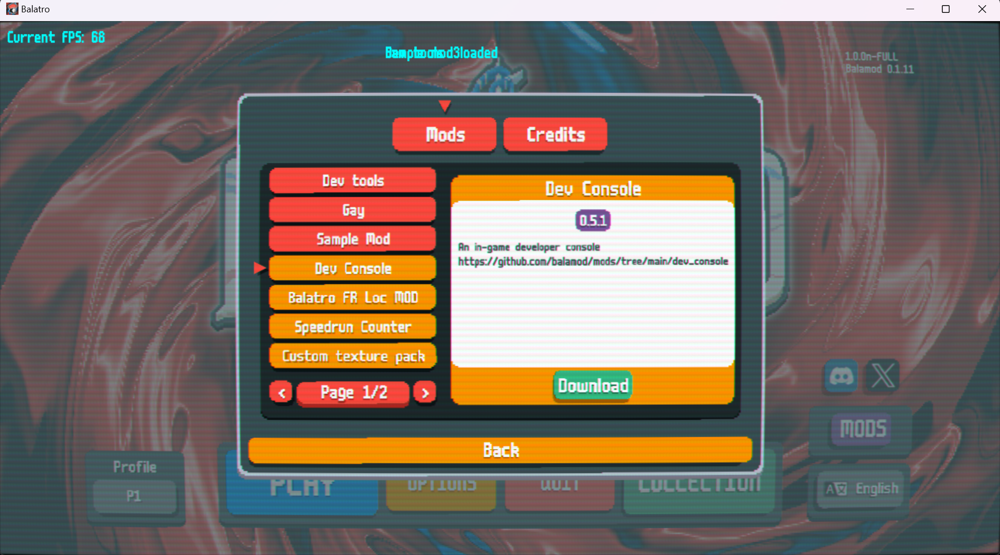

# Installation

If you are new to Balamod, this guide will help you install Balamod modloader on your game copy. 

After the injection, You are able to browse the mods contributed by the community in the in-game Mod Menu.



## Download Balamod Binary

You can download the latest Balamod binary from the [GitHub releases page](https://github.com/UwUDev/balamod/releases/latest).

Currently, the latest version is `{{ balamod.latest_tag }}` published on `{{ balamod.published_at | date(format="%Y-%m-%d %H:%M") }}`.

Download the binary that corresponds to your platform.

```admonish warning

Balamod currently doesn't work on macOS i386/amd64, but it will work on Apple Silicon(ARM64) aka M1/M2/M3.

```

| Platform | Download link |
|----------|---------------|
| Windows  | [{{ balamod.release_name_windows }}]({{ balamod.release_url_windows }}) |
| macOS    | [{{ balamod.release_name_macos }}]({{ balamod.release_url_macos }}) |
| Linux    | [{{ balamod.release_name_linux }}]({{ balamod.release_url_linux }}) |

## Install Balamod

### Windows

Execute the downloaded binary in a terminal with the following command:

```bash
{{ balamod.release_name_windows }} -a
```

~~~admonish info
For people who are not familiar with the command line, you can simply install Balamod as follows:

1. Open the folder where the downloaded binary is located.
2. Click the address bar and type `cmd` and press Enter.
3. Type `{{ balamod.release_name_windows }}` and press space.
4. Then add `-a` to the end of the command.
5. Press Enter.

The output of Command Prompt will look like this:

```cmd
C:\Users\user\Downloads\Programs>{{ balamod.release_name_windows }} -a
Found 1 Balatro installations.
Balatro v1.0.0n found !
Implementing modloader on main...
Implementing modloader on uidef...
Done!
Injecting main
Done!
Injecting uidef
Done!
Total time: 266.0006ms
Backup of executable: 18.2463ms
Modloader implementation (main): 234µs
Modloader implementation (uidef): 372µs
Modloader injection (main): 157.8571ms
Modloader injection (uidef): 86.2937ms

C:\Users\yxnia\Downloads\Programs>
```
~~~

### macOS

Double-click the downloaded file (`{{ balamod.release_name_macos }}`) and follow the installation instructions.

### Linux

Execute the downloaded binary in a terminal with the following command:

```bash
chmod +x {{ balamod.release_name_linux }}
{{ balamod.release_name_linux }} -a
```

## Verify Installation

To verify that Balamod is installed correctly. Just run Balatro Game and you will see the Balamod Version in the top right corner of the game.


## Update Balamod

To update Balamod, you need to restore the `balatro` to its original state and then install the new version of Balamod.

```admonish info
You can restore it with Steam by verifying the integrity of the game files.

Steam > Library > Right-click Balatro > Properties > Local Files > Verify Integrity of Game Files
```

After that, you can install the new version of Balamod.


